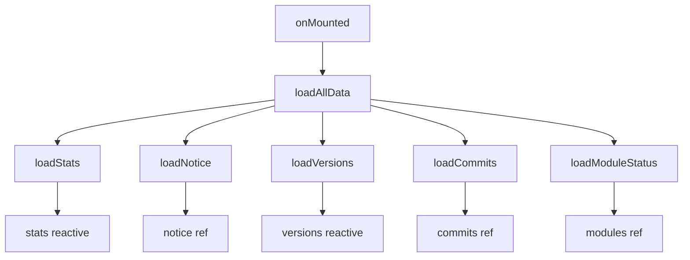

# GroupHelper 仪表盘重新设计规划

## 设计目标

采用 **Google Material Design 3** 风格，打造简洁、现代、功能丰富的仪表盘界面。

## 设计理念

### 1. Bento Box 布局

借鉴 Apple 和 Google 的 Bento Box 设计风格，将不同功能模块以卡片形式排列，形成整洁有序的网格布局。

```
┌────────────────────────────────────────────────────────────────┐
│  🎉 欢迎横幅 / Hero Section                                     │
│  显示插件名称、版本、运行状态                                      │
└────────────────────────────────────────────────────────────────┘

┌──────────────┐ ┌──────────────┐ ┌──────────────┐ ┌──────────────┐
│   📊 群组     │ │   ⚠️ 警告    │ │   🚫 黑名单   │ │   📡 订阅    │
│     12      │ │      5      │ │      3      │ │      8      │
│   已配置群组  │ │    警告记录   │ │   黑名单用户  │ │   活跃订阅   │
└──────────────┘ └──────────────┘ └──────────────┘ └──────────────┘

┌────────────────────────────────┐ ┌────────────────────────────────┐
│  📢 公告                        │ │  🔧 快速操作                    │
│                                │ │                                │
│  [公告内容 Markdown 渲染]       │ │  [配置] [角色] [黑名单] [日志]   │
│                                │ │                                │
└────────────────────────────────┘ └────────────────────────────────┘

┌────────────────────────────────┐ ┌────────────────────────────────┐
│  🏷️ 版本信息                    │ │  📝 最近更新                    │
│                                │ │                                │
│  当前: 1.0.0  ✓ 最新           │ │  • fix: 修复问题        2小时前  │
│  NPM:  1.0.0                   │ │  • feat: 新增功能       5小时前  │
│  Main: 1.0.0                   │ │  • docs: 更新文档       1天前   │
│  Dev:  1.0.1-alpha             │ │                                │
└────────────────────────────────┘ └────────────────────────────────┘

┌────────────────────────────────────────────────────────────────┐
│  📦 模块状态                                                    │
│                                                                │
│  [✓ 警告管理] [✓ 关键词] [✓ 防撤回] [✓ AI助手] [○ 订阅] ...    │
│                                                                │
└────────────────────────────────────────────────────────────────┘
```

### 2. Material Design 3 色彩系统

使用柔和的色调和语义化颜色：

| 用途 | 亮色模式 | 暗色模式 |
|------|----------|----------|
| 主色 (Primary) | `#1a73e8` | `#8ab4f8` |
| 成功 (Success) | `#34a853` | `#81c995` |
| 警告 (Warning) | `#fbbc04` | `#fdd663` |
| 危险 (Danger) | `#ea4335` | `#f28b82` |
| 表面 (Surface) | `#ffffff` | `#1e1e1e` |
| 背景 (Background) | `#f8fafc` | `#121212` |

### 3. 组件规范

#### 卡片样式
```css
.card {
  background: var(--surface);
  border-radius: 16px;
  box-shadow: 0 1px 3px rgba(0,0,0,0.08);
  border: 1px solid rgba(0,0,0,0.05);
  padding: 20px;
  transition: all 0.2s ease;
}

.card:hover {
  box-shadow: 0 4px 12px rgba(0,0,0,0.12);
  transform: translateY(-2px);
}
```

#### 统计卡片
```css
.stat-card {
  display: flex;
  flex-direction: column;
  gap: 12px;
}

.stat-icon {
  width: 48px;
  height: 48px;
  border-radius: 12px;
  display: flex;
  align-items: center;
  justify-content: center;
}

.stat-value {
  font-size: 2rem;
  font-weight: 600;
  font-feature-settings: "tnum";
}
```

## 新增功能模块

### 1. Hero 欢迎区域

顶部横幅，展示：
- 插件 Logo 和名称
- 当前版本号
- 运行状态指示器（🟢 正常运行）
- 上次启动时间

### 2. 快速操作入口

常用功能的快捷入口按钮：
- 群组配置
- 角色管理
- 黑名单管理
- 查看日志
- 设置

### 3. 模块状态概览

显示各功能模块的启用状态：
- ✅ 已启用（绿色）
- ⚪ 未启用（灰色）
- ⚠️ 配置不完整（黄色）
- ❌ 出错（红色）

### 4. 版本更新提示

当检测到新版本时，显示升级提示：
```
┌────────────────────────────────────────────┐
│  🎉 新版本可用                              │
│  v1.0.1 已发布，点击查看更新内容              │
│  [查看详情] [稍后提醒]                       │
└────────────────────────────────────────────┘
```

## 交互设计

### 1. 骨架屏加载

数据加载时显示骨架屏动画，而非简单的 "加载中..."：
```
┌──────────────┐
│ ████████     │
│ ██████       │
│ ████         │
└──────────────┘
```

### 2. 平滑过渡动画

- 卡片悬停：轻微上移 + 阴影加深
- 数据更新：数字滚动动画
- 页面切换：淡入淡出

### 3. 响应式适配

| 断点 | 布局 |
|------|------|
| < 640px | 单列布局，统计卡片 2x2 |
| 640px - 1024px | 双列布局 |
| > 1024px | 三列布局，完整 Bento |

## 技术实现

### 组件结构

```
DashboardView.vue
├── HeroSection        # 欢迎横幅
├── StatsGrid          # 统计卡片网格
├── NoticeCard         # 公告卡片
├── QuickActions       # 快速操作
├── VersionCard        # 版本信息
├── CommitsCard        # 更新日志
└── ModulesStatus      # 模块状态
```

### 数据流



### API 扩展

需要新增后端 API：

```typescript
// 获取模块状态
router.get('/modules/status', async () => {
  return {
    warn: { enabled: true, healthy: true },
    keyword: { enabled: true, healthy: true },
    antiRecall: { enabled: false, healthy: true },
    ai: { enabled: true, healthy: false, error: 'API 未配置' },
    // ...
  }
})

// 获取系统状态
router.get('/system/status', async () => {
  return {
    uptime: process.uptime(),
    startTime: startTime.toISOString(),
    memory: process.memoryUsage(),
    version: pkg.version,
  }
})
```

## 实现优先级

1. **P0 - 核心布局**
   - Bento Box 网格布局
   - Material Design 3 卡片样式
   - 响应式适配

2. **P1 - 现有功能优化**
   - 统计卡片美化
   - 版本信息卡片优化
   - 更新日志卡片优化
   - 公告卡片优化

3. **P2 - 新增功能**
   - Hero 欢迎区域
   - 快速操作入口
   - 骨架屏加载

4. **P3 - 增强功能**
   - 模块状态概览
   - 版本更新提示
   - 动画效果

## 样式变量

```css
:root {
  /* Colors */
  --md3-primary: #1a73e8;
  --md3-on-primary: #ffffff;
  --md3-secondary: #5f6368;
  --md3-surface: #ffffff;
  --md3-surface-variant: #f8fafc;
  --md3-on-surface: #202124;
  --md3-outline: rgba(0, 0, 0, 0.12);
  
  /* Elevation */
  --md3-elevation-1: 0 1px 3px rgba(0,0,0,0.08);
  --md3-elevation-2: 0 4px 12px rgba(0,0,0,0.12);
  --md3-elevation-3: 0 8px 24px rgba(0,0,0,0.16);
  
  /* Radius */
  --md3-radius-sm: 8px;
  --md3-radius-md: 12px;
  --md3-radius-lg: 16px;
  --md3-radius-xl: 24px;
  
  /* Spacing */
  --md3-spacing-xs: 4px;
  --md3-spacing-sm: 8px;
  --md3-spacing-md: 16px;
  --md3-spacing-lg: 24px;
  --md3-spacing-xl: 32px;
  
  /* Typography */
  --md3-font-display: 2.5rem;
  --md3-font-headline: 1.5rem;
  --md3-font-title: 1.125rem;
  --md3-font-body: 1rem;
  --md3-font-label: 0.875rem;
}

/* Dark mode */
[data-theme="dark"] {
  --md3-primary: #8ab4f8;
  --md3-on-primary: #003d92;
  --md3-surface: #1e1e1e;
  --md3-surface-variant: #2d2d2d;
  --md3-on-surface: #e8eaed;
  --md3-outline: rgba(255, 255, 255, 0.12);
}
```

## 预期效果

最终效果应该是：
- 🎨 **视觉现代化**：Material Design 3 风格，柔和的色彩和阴影
- 📱 **响应式设计**：完美适配桌面和移动设备
- ⚡ **性能优化**：骨架屏、懒加载、平滑动画
- 🔍 **信息丰富**：一眼了解插件运行状态
- 🚀 **快速访问**：常用功能一键直达